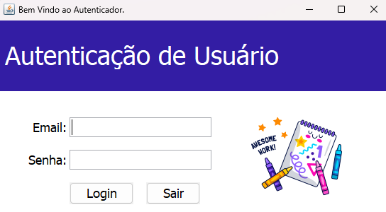
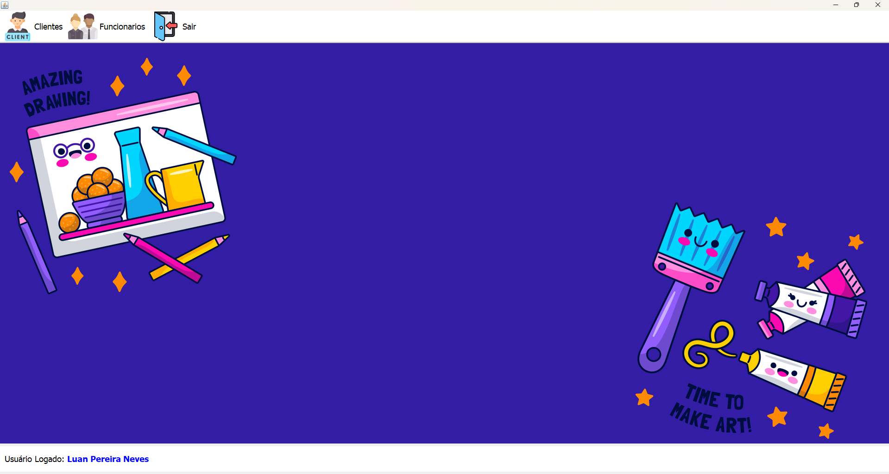
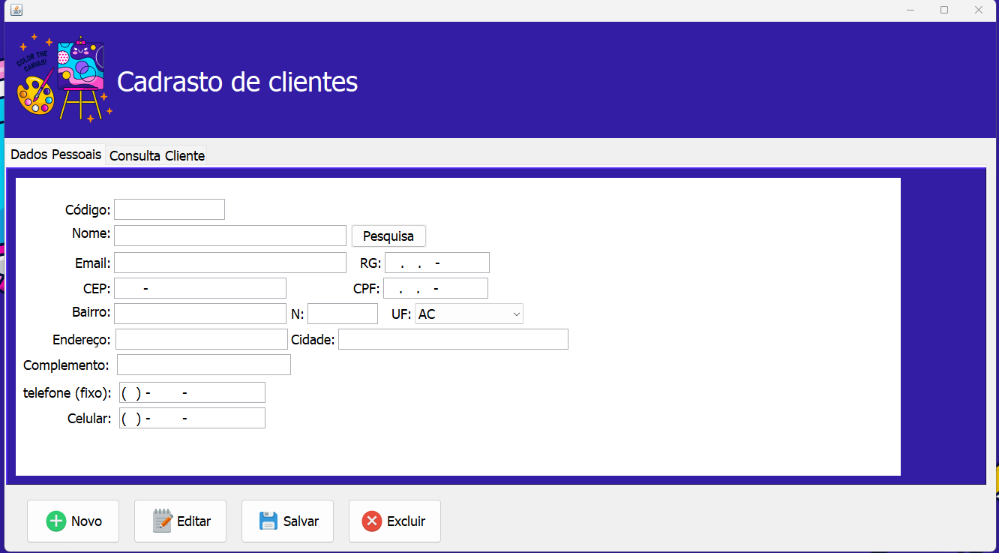
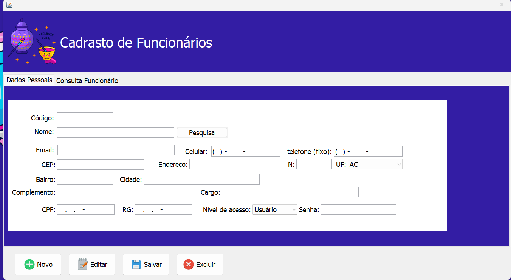
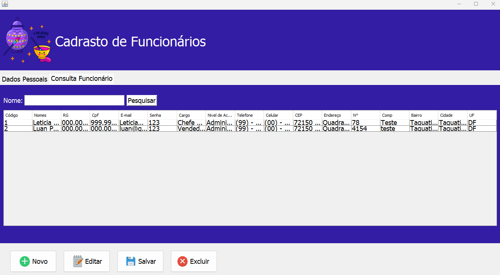

# Aplicativo de Cadastro de Clientes e Funcionários

Este projeto é um aplicativo de cadastro de clientes e funcionários desenvolvido em Java e MySQL. Ele foi criado como parte de um projeto da faculdade para uma microempresa que precisava gerenciar informações de seus clientes e funcionários. No futuro, o aplicativo pode ser atualizado para se tornar um sistema completo de vendas.

## Capturas de Tela

### Tela de Login


Descrição: A tela de login permite que os usuários autorizados acessem o sistema. É a porta de entrada para o aplicativo.

### Menu Principal


Descrição: O menu principal oferece acesso rápido a todas as funcionalidades do sistema, incluindo o cadastro e consulta de clientes e funcionários.

### Cadastro de Cliente


Descrição: A tela de cadastro de cliente permite adicionar novos clientes ao sistema, armazenando informações como nome, endereço e contato.

### Cadastro de Funcionário


Descrição: A tela de cadastro de funcionário permite adicionar novos funcionários ao sistema, armazenando informações como nome, endereço, cargo e salário.

### Consulta de Funcionários


Descrição: A tela de consulta de funcionários permite visualizar e pesquisar informações dos funcionários cadastrados no sistema.

## Descrição do Projeto

O objetivo principal deste projeto foi desenvolver um sistema de cadastro para uma microempresa, permitindo a gestão eficiente de informações de clientes e funcionários. As funcionalidades incluem:

- Cadastro de clientes e funcionários
- Consulta de informações cadastradas
- Autenticação de usuário para acesso seguro

## Tecnologias Utilizadas

- **Java**: Linguagem de programação utilizada para desenvolver a lógica do aplicativo.
- **Java Swing**: Biblioteca gráfica utilizada para criar a interface do usuário.
- **MySQL**: Sistema de gerenciamento de banco de dados utilizado para armazenar as informações de clientes e funcionários.

## Como Usar

1. Clone o repositório para a sua máquina local:
    ```bash
    git clone https://github.com/usuario/aplicativo-cadastro.git
    cd aplicativo-cadastro
    ```

2. Configure o banco de dados MySQL:
    - Crie um banco de dados no MySQL.
    - Importe o script SQL fornecido (`database.sql`) para criar as tabelas necessárias.
    - Atualize o arquivo de configuração do banco de dados (`dbConfig.java`) com suas credenciais do MySQL.

3. Compile e execute o aplicativo:
    ```bash
    javac -cp .:mysql-connector-java-8.0.23.jar Main.java
    java -cp .:mysql-connector-java-8.0.23.jar Main
    ```

## Estrutura do Projeto

- `Main.java`: Arquivo principal que inicia o aplicativo.
- `Login.java`: Tela de login.
- `MenuPrincipal.java`: Menu principal do aplicativo.
- `CadastroCliente.java`: Tela de cadastro de clientes.
- `CadastroFuncionario.java`: Tela de cadastro de funcionários.
- `ConsultarFuncionarios.java`: Tela de consulta de funcionários.
- `dbConfig.java`: Arquivo de configuração do banco de dados.
- `database.sql`: Script SQL para criar as tabelas no MySQL.
- `img/`: Pasta contendo as imagens usadas no README.

## Contribuição

Contribuições são bem-vindas! Sinta-se à vontade para enviar pull requests com melhorias ou sugestões.

## Licença

Este projeto está licenciado sob a MIT License. Consulte o arquivo `LICENSE` para mais informações.

---

Desenvolvido como parte de um projeto da faculdade para uma microempresa.
